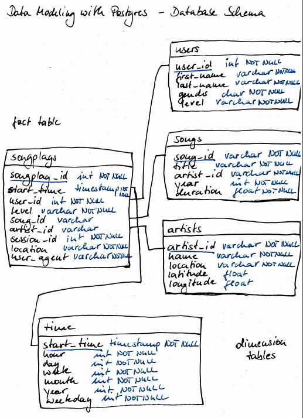
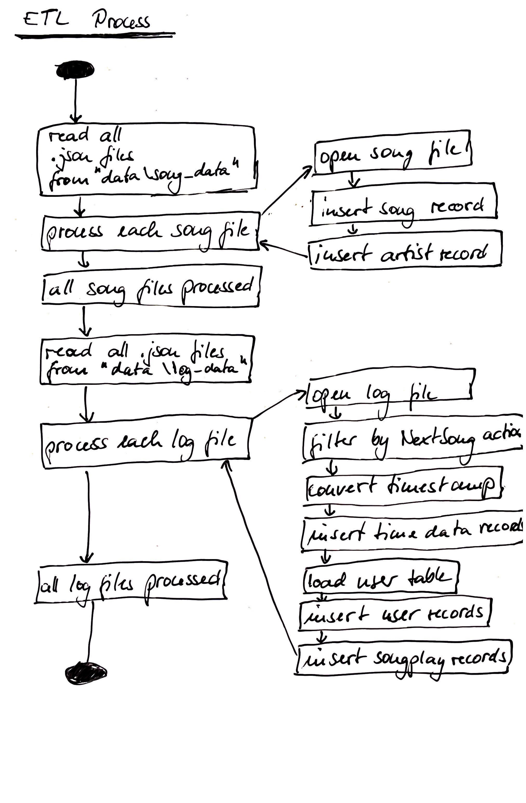

# Data Modeling with Postgres

## Introduction
A startup called Sparkify wants to analyze the data they've been collecting on songs and user activity on their new music streaming app. The analytics team is particularly interested in understanding what songs users are listening to. Currently, they don't have an easy way to query their data, which resides in a directory of JSON logs on user activity on the app, as well as a directory with JSON metadata on the songs in their app.

They'd like a data engineer to create a Postgres database with tables designed to optimize queries on song play analysis. The data engineer shall create a database schema and ETL pipeline using Python for this analysis. The database consists of a fact and dimension tables in a star schema for a particular analytic focus. The ETL pipeline transfers data from files in two local directories into these tables in Postgres using Python and SQL.

## Project Structure
```
    .ProjectWorkspace                           # main folder 
    ├── data                                    # contains all JSON log files 
    │   ├── log_data                            # Log dataset
    │   │   ├── ...
    │   ├── song_data                           # song dataset
    │   │   ├── ...
    ├── images                                  # images
    │   ├── log-data.png
    │   ├── erm.png
    │   ├── etl.jpg
    ├── create_tables.py                        # creates the postgres database
    ├── etl.ipynb                               # reads and processes files from song_data and log_data and loads them into your tables
    ├── etl.py                                  # reads and processes a single file from song_data and log_data and loads the data into the tables
    ├── execution.ipynb                         # runs create_tables.py and etl.py
    ├── README.md                               # provides discussion on your project
    ├── sql_queries.py                          # contains all the sql queries
    └── test.ipynb                              # displays the first few rows of each table to let you check your database

```

## Datasets
### Song Dataset
The first dataset is a subset of real data from the Million Song Dataset. Each file is in JSON format and contains metadata about a song and the artist of that song. The files are partitioned by the first three letters of each song's track ID. For example, here are filepaths to two files in this dataset.

```
song_data/A/B/C/TRABCEI128F424C983.json
song_data/A/A/B/TRAABJL12903CDCF1A.json

```

And below is an example of what a single song file, TRAABJL12903CDCF1A.json, looks like.

```
{"num_songs": 1, "artist_id": "ARJIE2Y1187B994AB7", "artist_latitude": null, "artist_longitude": null, "artist_location": "", "artist_name": "Line Renaud", "song_id": "SOUPIRU12A6D4FA1E1", "title": "Der Kleine Dompfaff", "duration": 152.92036, "year": 0}

```

### Log Dataset
The second dataset consists of log files in JSON format generated by this event simulator based on the songs in the dataset above. These simulate activity logs from a music streaming app based on specified configurations.

The log files in the dataset you'll be working with are partitioned by year and month. For example, here are filepaths to two files in this dataset.

```
log_data/2018/11/2018-11-12-events.json
log_data/2018/11/2018-11-13-events.json

```

And below is an example of what the data in a log file, 2018-11-12-events.json, looks like.


## Database Schema

The following picture states the ERM for the Postgres database. The database is a star schema optimized for queries on song play analysis. It contains the fact table songplays and the dimension tables users, songs, artists, and time.


## ETL pipeline

The data is processed in the following way:


## Executing the ETL Pipeline

The file executuin.ipnyb can be used to generate the database (call create_tables.py) and to run the ETL pipeline (call etl.py).

## Result

Since this is a subset of the much larger dataset, the solution dataset will only have 1 row with values for value containing ID for both songid and artistid in the fact table. Those are the only 2 values that the query in the sql_queries.py will return that are not-NONE. The rest of the rows will have NONE values for those two variables.

This is the result data set:
